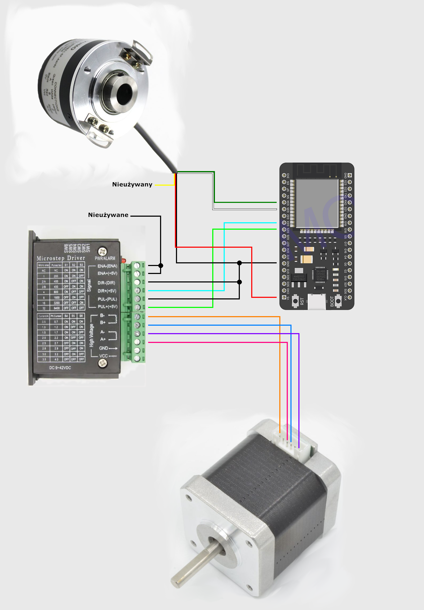

# Podłączanie przewodów do ESP

Poniżej przedstawiono wymagane podłączenia pinów kontrolera ESP 32. Jest to konfiguracja aktualna co do kodu na repozytorium wraz z dniem **16.06.2026**.

## Sterownik TB6600

### Signal

Poniżej przedstawiono złącza sygnałowe sterownika TB6600 oraz piny na ESP 32 do których trzeba je podłączyć:

- ENA+: odłączony
- ENA-: odłączony
- DIR-: pin GND
- DIR+: G33
- PUL-: GND
- PUL+: pin G25

### High Voltage

Poniżej przedstawiono połączenia złączy zasilających sterownika TB6600 do steppera obrotowego. Numeracja złącz steppera jest od lewej do prawej, patrząc od strony elementu obrotowego.

1. B-
2. Odłączony
3. A+
4. B+
5. Odłączony
6. A-

#### Złącza VCC i GND

Złącza VCC i GND enkodera powinny zostać połączone do kabla zasilającego sterownika.

## Enkoder obrotu

Poniżej przedstawiono połączenia złączy enkodera obrotowego do kontrolera ESP 32.

#### Złącza logiczne

- Kanał A enkodera (kabel zielony): G34
- Kanał B enkodera (kabel biały): G35
- Kanał Z enkodera (kabel żółty): Odłączony

#### Złącza zasilania

- Kanał VCC enkodera (kabel czerwony): pin 5V
- Kanał 0V enkodera (kabel czarny): pin GND

# Schemat podłączania

Poniżej zamieszczono schemat podłączania kabli w formie graficznej. **Nie zostały uwzględnione kable zasilające. Sterownika, a jedynie kable zasilające enkodera**.

